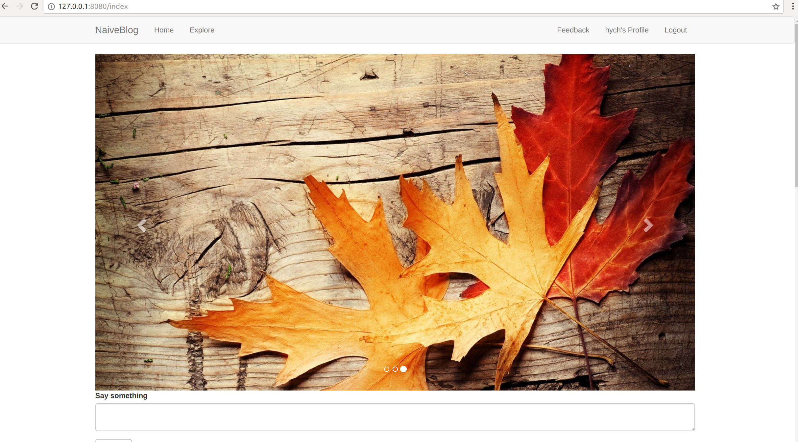
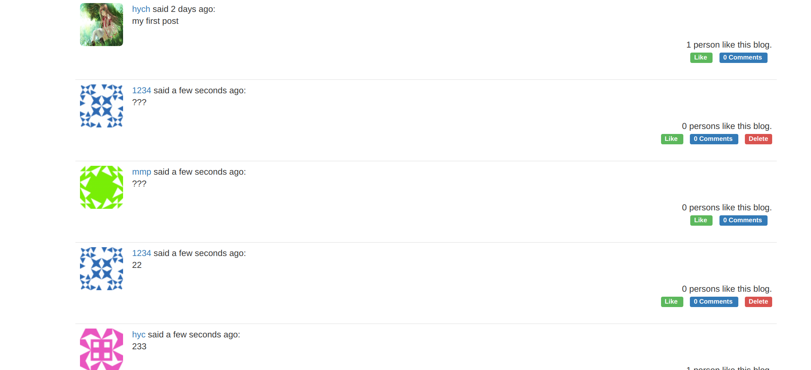
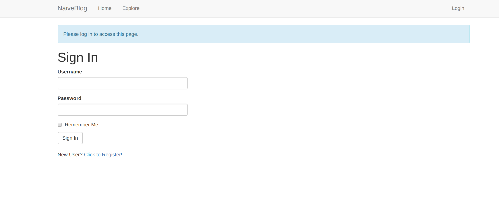
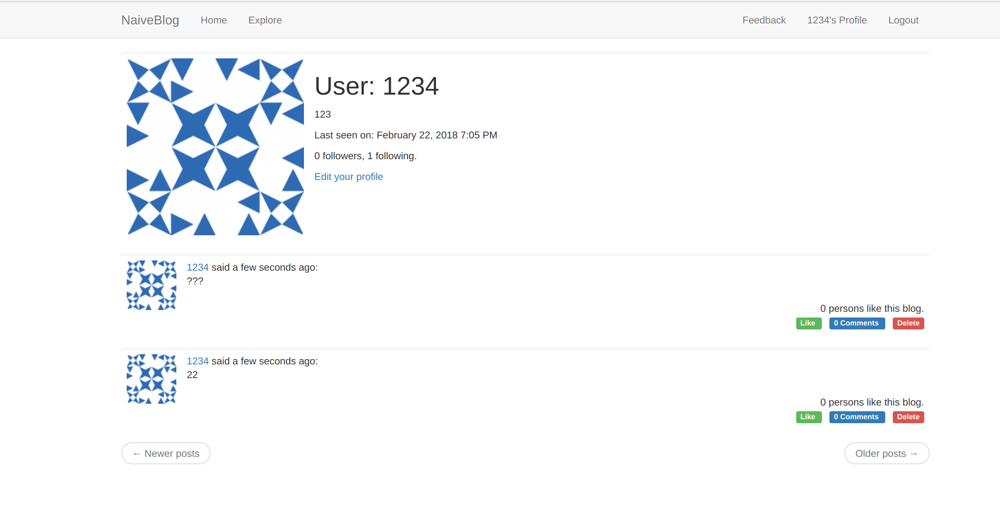
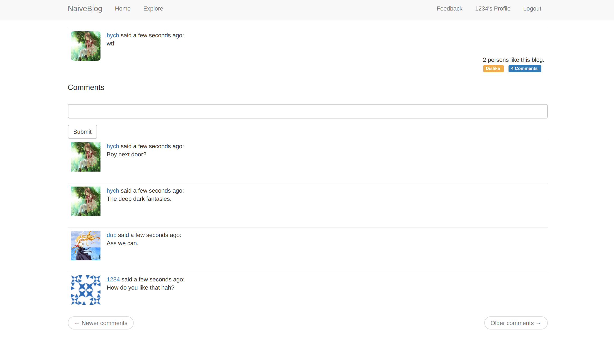

<h1>项目说明</h1>

<ul>
<li><code>TCP</code>利用socket编程，实现服务器与客户端的交互。其中<code>echo</code>实现了响应，<code>adder</code>服务器接受到客户端发送的两个数，并返回它们的和。</li>
<li><code>HTTPServer</code>利用socket实现了HTTP协议的报文解析和收发，能够在网页上进行响应并打印Hello, World!且当url呈现为<code>http://127.0.0.1:8080/add/(num1)/(num2)</code>时，会在网页呈现<code>num1 + num2 = result</code></li>
<li><code>blog</code>一个精心原创的较为完整的博客，后端采用<code>flask</code>和<code>sqlalchemy</code>，前端采用<code>html, css, javascript</code>和<code>bootstrap</code>。它具有如下功能：
<ul>
<li>用户的注册与登录</li>
<li>文章的撰写、呈现与删除</li>
<li>用户之间的follow与被follow关系</li>
<li>能够点赞文章和评论文章</li>
<li>能上传自定义头像和编辑个人资料</li>
<li>用户能向网站运营者反馈意见</li>
</ul></li>

<h1>编译说明</h1>

<li><code>TCP</code>首先<code>$ python server.py</code>，其次<code>$ python client.py</code>，观察响应情况<li>
<li><code>HTTPServer</code>通过<code>$ python webServer.py</code>即可启动服务器。</li>
<li><code>blog</code>需要配置环境，利用<code>pip</code>安装<code>/app</code>中相关的各个库，然后通过<code>$ python run.py</code>可在debug模式下运行，通过<code>$ python runp.py</code>可在非debug模式下运行，建议后者。</li>

<h1>效果展示</h1>

HTTPServer的加法结果如下：

博客的主页如下：

登录页如下：

用户页如下：

单个博客如下：

